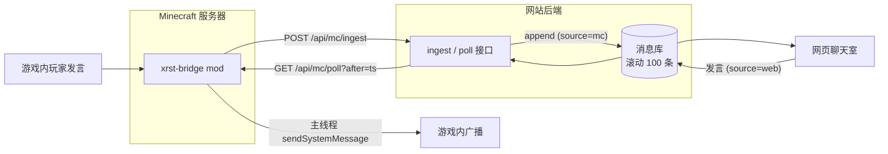

# XRWebMC_Bridge

Minecraft 服务器与网站聊天室的**双向消息互通桥**。本仓库包含：

1. **Fabric 服务端 mod**（本仓库根目录，可直接构建的 Gradle 工程）——跑在 MC 服务器上，负责两个方向的消息搬运；
2. **网页侧 API 协议文档**——网站后端需要实现的两个 HTTP 接口（本文档已给出完整规范与参考实现要点）。

## 整体架构

三个角色，两个方向，一本公共账本：

```
                 ┌─────────────────────────────┐
                 │   Minecraft 服务器 (Fabric)  │
                 │   xrst-bridge mod           │
                 └──────┬──────────────▲───────┘
        ① POST /api/mc/ingest │        │ ④ 每 4 秒 GET /api/mc/poll?after=<ts>
        （游戏聊天上报）        │        │    （拉取网页新消息）
                 ▼            │        │
                 ┌────────────┴────────┴───────┐
                 │   网站后端（如 Cloudflare     │
                 │   Worker）                   │
                 └──────────────┬──────────────┘
                                │ ② append / ③ 读取
                                ▼
                 ┌─────────────────────────────┐
                 │        消息库（按时间排序，   │
                 │   滚动保留最近 100 条）       │
                 └─────────────────────────────┘
                                ▲
                                │ ⑤ 网页前端轮询/推送读取
                          ┌─────┴─────┐
                          │  网页聊天室 │
                          └───────────┘
```



## 为什么是"拉"而不是"推"？

多数面板服（简幻欢等）**只把游戏端口映射到公网**，RCON 端口（25575）根本无法从外部访问，网站后端无法主动"推进"游戏。而服务器**出站 HTTPS 永远可用**，所以让 mod 反过来定时拉取——无需开放任何额外端口，无需暴露 RCON 密码。

---

## 通信协议

两个接口共用一个密钥鉴权：请求头 `X-MC-Secret: <共享密钥>`。密钥存放在网站后端环境变量（如 `MC_INGEST_SECRET`）和 mod 配置文件中，**绝不出现在网页前端**。

### 消息对象（两个方向通用）

```json
{
  "id": "mu4p6m8d9zis7y",       // 网页消息的唯一 id（游戏上报方向可省略）
  "username": "AaronXie",        // 发言者
  "text": "你们好啊",             // 正文
  "ts": 1789641431045,           // 毫秒时间戳（Date.now()），既排序又当同步游标
  "source": "web"                // "web" 或 "mc"，决定消息流向（见下文防回环）
}
```

### ① 游戏 → 网页：`POST /api/mc/ingest`

mod 在玩家聊天时异步上报：

```
POST /api/mc/ingest
X-MC-Secret: <密钥>
Content-Type: application/json

{"username":"Steve","text":"大家好"}
```

网站后端处理：

1. 校验密钥，不一致返回 `401`；
2. 校验格式：用户名符合 MC 正版规则 `^[A-Za-z0-9_]{3,16}$`，正文 1–256 字符；
3. 补全 `{id, ts, source:"mc"}` 后写入消息库；
4. 网页聊天室随下次读取自然显示。

### ② 网页 → 游戏：`GET /api/mc/poll?after=<ts>`

mod 每 4 秒（可配置）拉取一次：

```
GET /api/mc/poll?after=1789641431045
X-MC-Secret: <密钥>
```

网站后端处理：

1. 校验密钥；
2. 从消息库过滤出 `source !== "mc"`（**游戏来源的消息不回灌游戏**，防止玩家看到自己发言的复读）且 `ts > after` 的消息；
3. 返回：

```json
{
  "ok": true,
  "messages": [ { "username": "...", "text": "...", "ts": 1789641431045, "source": "web" } ],
  "latest": 1789641432000     // 可选：库内最新 ts，帮助 mod 推进游标
}
```

### 时间戳游标语义（同步的关键）

- mod 维护游标 `lastTs`，初始为**服务器启动时刻**；
- 只广播 `ts > lastTs` 的消息，广播后推进游标；
- 服务器断线/网络抖动期间漏掉的消息，恢复后自动补发（补发量受消息库 100 条上限约束）；
- 服务器重启后游标重置，重启前积压的消息**不会**补发（避免刷屏）。

---

## 服务端安装（mod）

通用要求：Fabric Loader ≥ 0.16.0、Fabric API、仅服务端。**每个 Minecraft 版本对应一个专用 jar**（jar 内写有精确版本约束，装错版本加载器会直接拒绝）。

### 支持的 Minecraft 版本

| Minecraft | Java | jar 后缀 |
|---|---|---|
| 1.20.6 | 21 | `+1.20.6` |
| 1.21.1 | 21 | `+1.21.1` |
| 1.21.4 | 21 | `+1.21.4` |
| 1.21.6 | 21 | `+1.21.6` |
| 1.21.8 | 21 | `+1.21.8` |
| 1.21.11 | 21 | `+1.21.11` |
| 26.2 | 25 | `+26.2` |

> 说明：1.21.11 及更早版本是混淆版，mod 经 Loom 用 Mojang 官方映射编译并 remap 到 intermediary；26.x 起官方不再混淆。两类版本共用同一份源码（基于 [Stonecutter](https://stonecutter.kikugie.dev/) 多版本构建）。1.20.5 以下的老版本（如 1.8.9 / 1.12.2）需 Forge 与 Java 8，不在支持范围。

### 方式一：下载预构建 jar（推荐）

到 [Releases 页面](https://github.com/AaronXieA/XRWebMC_Bridge/releases)，下载文件名中带**与你服务器 Minecraft 版本一致后缀**的 `xrst-bridge-<mod版本>+<MC版本>.jar`，放入服务器 `mods/` 目录即可。

例：服务器是 1.21.1 就下 `xrst-bridge-1.3.0+1.21.1.jar`；是 26.2 就下 `xrst-bridge-1.3.0+26.2.jar`。

### 方式二：自行从源码构建

工程使用 Stonecutter 管理多版本。运行 Gradle 需 **JDK 21+**；构建 26.x 节点额外需要本机装有 **JDK 25**（或配置工具链自动下载）。

构建单个版本（产物在 `versions/<MC版本>/build/libs/`）：

```bash
./gradlew build -Pstonecutter.active=1.21.1
```

一次性构建全部版本：

```bash
for v in 1.20.6 1.21.1 1.21.4 1.21.6 1.21.8 1.21.11 26.2; do
  ./gradlew build -Pstonecutter.active=$v
done
```

把产物放入服务器 `mods/` 目录。

### 安装后的配置（必填）

mod **不内置任何默认服务器地址**。首次启动会在 `config/xrst-bridge.properties` 生成配置文件（此时不会启动任何转发），必须填入**你自己的网站接口地址**和密钥后重启：

```properties
enabled=true
# 游戏 -> 网页：你的网站上报接口（留空则关闭该方向）
webhook-url=https://example.com/api/mc/ingest
# 网页 -> 游戏：你的网站轮询接口（留空则关闭该方向）
poll-url=https://example.com/api/mc/poll
poll-enabled=true
poll-interval=4
# 与网站后端共享密钥一致（必须改掉 CHANGE_ME）
secret=请改成你自己的随机密钥
```

### 配置项

| 配置项 | 默认值 | 说明 |
|---|---|---|
| `enabled` | `true` | 总开关；`false` 时两个方向都不启动 |
| `webhook-url` | 空（必填才启动） | 上报接口地址（你的网站，不是任何人的固定域名） |
| `poll-enabled` | `true` | 网页→游戏轮询开关 |
| `poll-url` | 空（必填才启动） | 拉取接口地址 |
| `poll-interval` | `4` | 轮询间隔（秒，最小 2） |
| `secret` | `CHANGE_ME` | 共享密钥，必须与网站后端一致 |

> URL 留空只会关闭对应方向（可单向运行）；但 `secret` 为空或仍是 `CHANGE_ME` 时，两个方向都不会启动。

### 启动成功的标志

```
[XRST-Bridge] 游戏 -> 网页 已启动：https://example.com/api/mc/ingest
[XRST-Bridge] 网页 -> 游戏 已启动，每 4 秒拉取一次：https://example.com/api/mc/poll
```

若看到 `未配置 secret` 或 `webhook-url 与 poll-url 均为空`，说明配置没填，按上面模板补全后重启。

常见问题：日志出现 `密钥被拒绝（401）` → 配置文件里的 `secret` 与网站后端不一致；轮询报 5xx → 检查网站后端接口（参考本文协议逐字段核对）。

---

## 网页侧实现要点

以 Cloudflare Worker + Durable Object 为例（本站实际实现）：

- **消息库**：Durable Object 内 SQLite 表按 `ts` 排序，滚动淘汰第 100 条之外的旧消息；KV 也能胜任，但要注意免费额度。
- **鉴权**：`X-MC-Secret` 与环境变量 `MC_INGEST_SECRET` 恒等比较；
- **前端可见性**：网页聊天室按 `source` 字段区分样式（如给 MC 消息加 🎮 图标）；实时性可用 WebSocket，兜底用轮询；
- **接口隔离**：`/api/mc/*` 只服务 mod，普通用户接口不暴露密钥相关逻辑。

## 防御性设计

- mod 的任何异常（网络失败、密钥错误、解析失败）都**不影响游戏本身**——上报是"旁路"，聊天照常进行；
- 轮询请求带去重保护：上一次请求未返回时跳过本次，避免请求堆积；
- 双向去回环：`source` 过滤保证每条消息在每个世界只出现一次；
- 密钥校验失败返回 401 而非静默，便于从日志发现配置错误。

## License

MIT
